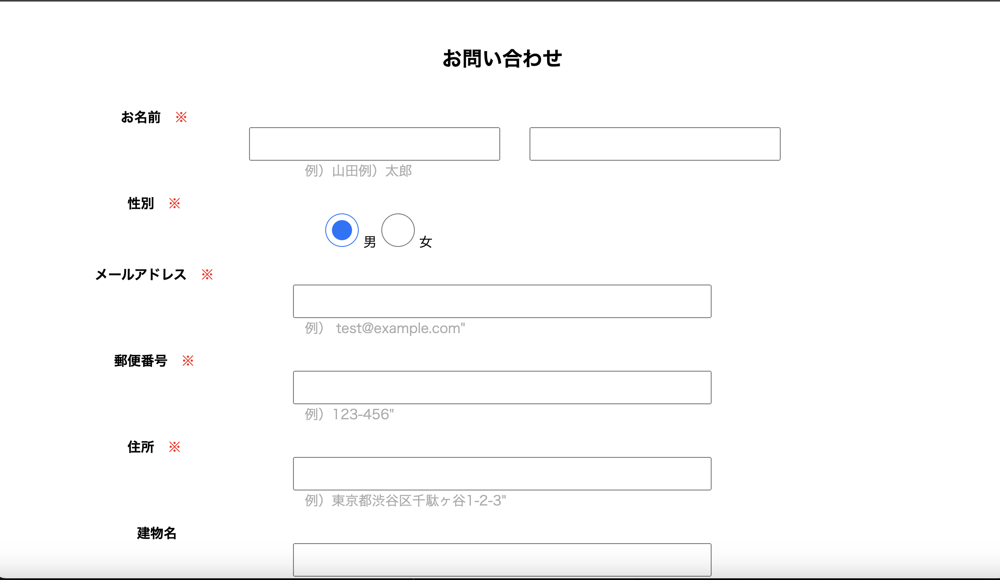
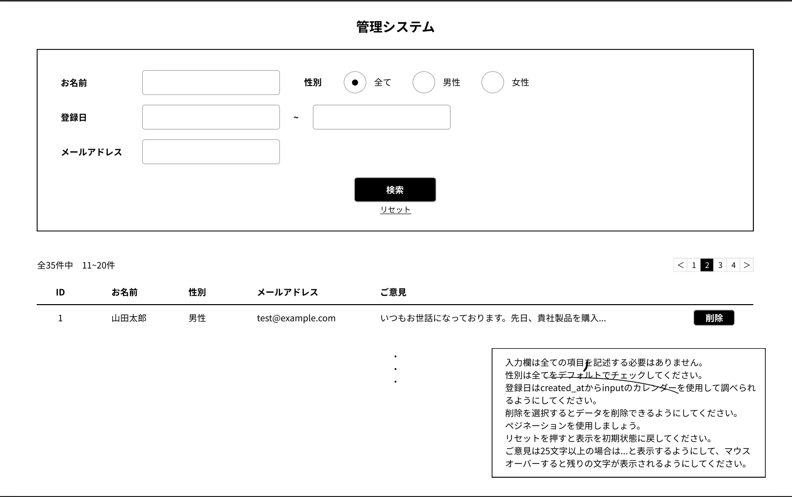
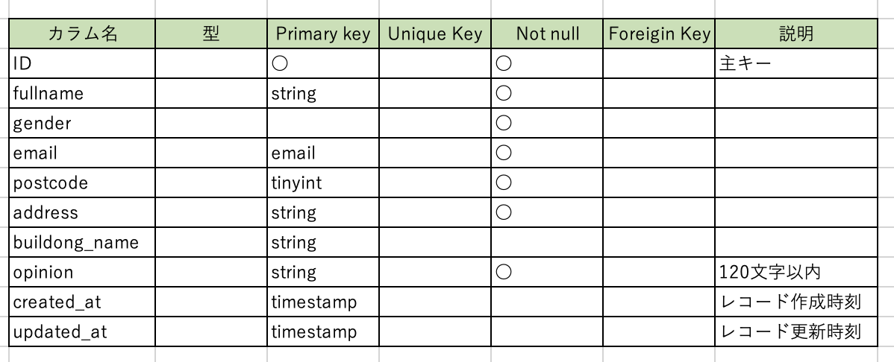

# アプリケーション名

お問合せフォーム・管理リスト

## 作成した目的

確認テストのため作成した。

## アプリ URL

## 機能一覧

問い合わせフォーム
フォーム入力機能・入力内容の保持機能・入力内容の確認後の修正機能・データベースへの保持機能・エラー表示機能・住所と郵便番号が一致しない場合のエラー表示

検索管理システム
データベース内のデータ検索機能・リセット機能・データの削除機能・マウスオーバー機能・ページネーション機能

## 使用技術

Laravel8、PHP、MYSQL、NGINX

## テーブル設計

## 今回の反省点

HTML から CSS のフロント部分で躓き、まだ思うようにデザインができない点、入力した時にすぐエラー表示する機能・郵便番号入力時に自動で住所検索される機能、ページネーションのデザイン設定が難しく思うように反映できず、教材、ネット共に解決策を探したが改善ができなかった。

